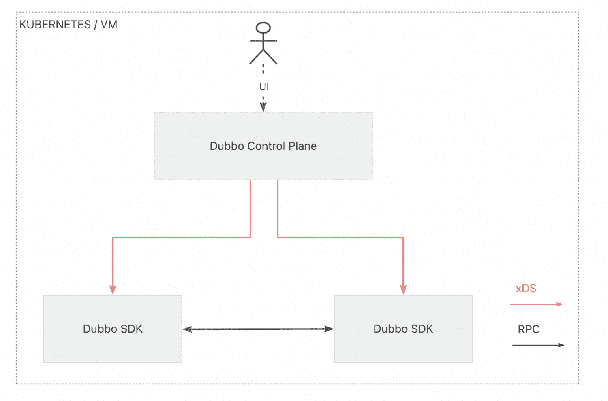
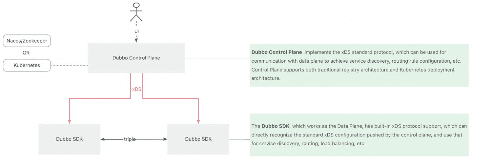
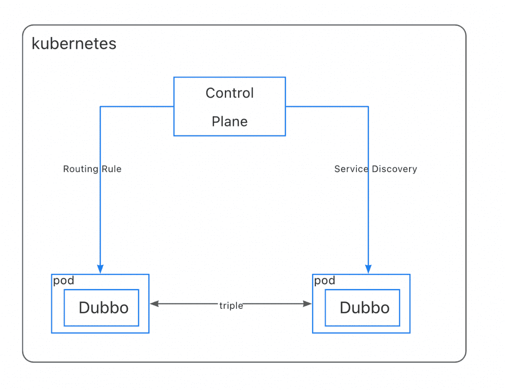
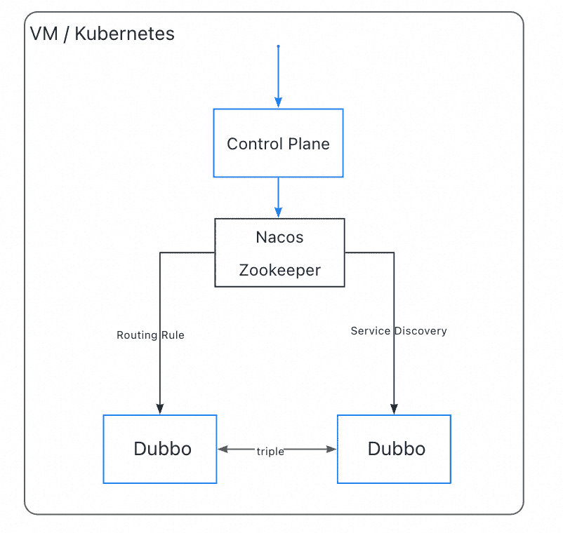
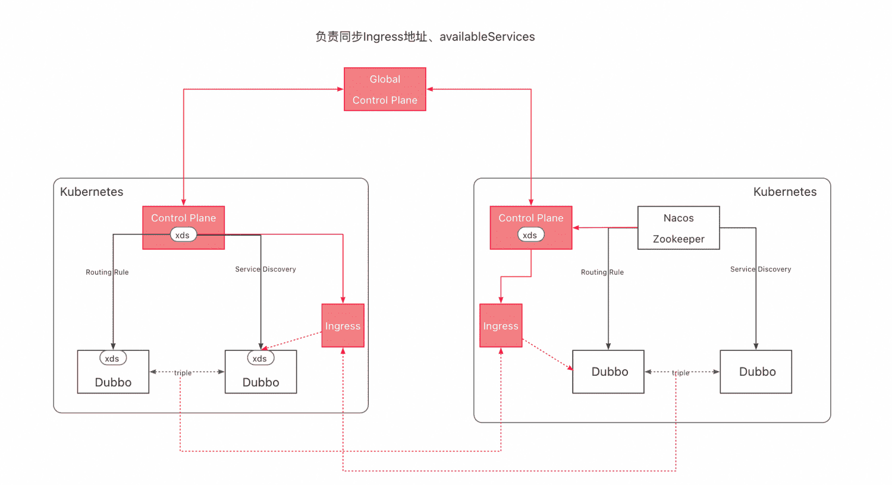

<h1 align="center">
The Dubbo Kubernetes Integration
</h1>

<p align="center" style="color: red; font-weight: bold;">
⚠️ This is still an experimental version. ⚠️
</p>

[](https://github.com/apache/dubbo-kubernetes/actions/workflows/ci.yml)
[](https://codecov.io/gh/apache/dubbo-kubernetes)


**The universal Control Plane and Console for managing microservices on any environment - VM and Kubernetes.**



## Quick Start (under development)
> NOTICE: As the project has not been officially released yet, the following commands may not run properly. The best way for now is to refer to the [Development Guide] () to learn how to download the source code and build it locally!


1. Download `dubbo-control-plane` binary package.
```shell
curl -L https://raw.githubusercontent.com/apache/dubbo-kubernetes/master/release/downloadDubbo.sh | sh -

cd dubbo-$version
export PATH=$PWD/bin:$PATH
```

2. Install `control-plane` on Kubernetes
```shell
dubboctl install --profile=demo
```

3. Check installation
```shell
kubectl get services -n dubbo-system
```

Next, deploy Dubbo applications to Kubernetes as shown below:

```yaml
apiVersion: v1
kind: Service
metadata:
  name: demo-service
  namespace: dubbo-demo
spec:
  selector:
    app: dubbo-demo
  type: ClusterIP
  ports:
    - name: port1
      protocol: TCP
      appProtocol: http
      port: 80
      targetPort: 8080
---
apiVersion: apps/v1
kind: Deployment
metadata:
  name: example-app
  namespace: dubbo-demo
spec:
  ...
  template:
    metadata:
      ...
      labels:
        dubbo.apache.org/sidecar-injection: enabled
    spec:
      containers:
        ...
```

> If you want to create your own Dubbo application from scratch and deploy it, please use `[dubboctl]()`we provided below.


Open the following page to check deployment status on control plane UI:
```shell
kubectl port-forward svc/dubbo-control-plane \
  -n dubbo-system 5681:5681
```

visit, 127.0.0.1:5681/admin
## Architecture



The microservcice architecture built with Dubbo Control Plane consists of two main components:

- The `**Dubbo Control Plane**` configures the data plane - applications developed with Dubbo SDK, for handling service traffic. Users create [policies]() that the dubbo control plane processes to generate configurations for the data plane.
- The data plane - the `**Dubbo SDK**`, connets directly to control plane and receives configurations that can work as the sources for service discovery, traffic routing, load balancing, etc.

Dubbo Control Plane supports two depoyment modes:`**kubernetes**`and `**universal**.`

- `**kubernetes**` is like the classic Service Mesh architecture, with all microservices concepts bond to kubernetes resources. Comparing to classic service mesh solutions like istio, Dubbo favors a proxyless mode - with no envoy sidecar.
- `**universal**`** **is the traditional microservice architecture that all Dubbo users are already familar with. Unlike service mesh, it usually needs a dedicatd registry like Nacos or Zookeeper for service discovery, etc.

### Kubernetes
In kubernetes mode, the control plane will interact directly with the Kubernetes API-SERVER, watching the kubernetes resources and tranform them as xDS resources for service discovery and traffic management configurations.



We all know the `service`definition of Kubernetes and Dubo are different, `Kubernetes Service` is more like an application concent run on a selected group of pods while `Dubbo Service` can mean a specific RPC service inside the application process. So how does dubbo control plane manages to bridge the `interface-application` gap, check here for more details.

### Universal
In Universal mode, Dubbo still uses Nacos or Zookeeper as registries for service discovery, control plane then interact with registry directly to work as the console UI,  as the entry point for viewing and managing the cluster.



### Multiple cluster
Dubbo Control Plane supports running your services in multiple zones. It is even possible to run with a mix of Kubernetes and Universal zones. Your microservice environment can include multiple isolated services, and workloads running in different regions, on different clouds, or in different datacenters. A zone can be a Kubernetes cluster, a VPC, or any other deployment you need to include in the same distributed mesh environment. The only condition is that all the data planes running within the zone must be able to connect to the other data planes in this same zone.

Dubbo Control Plane supports a `**global**`deployment mode that can connect differenct `**zone**` region clusters. The picture below shows how it works.



## Roadmap

- Security
- Metrics
- Cross-cluster communication
- Console

## Refereces

- Dubboctl
- Console UI Design
- Dubbo java xDS implementation
- Dubbo go xDS implementation
